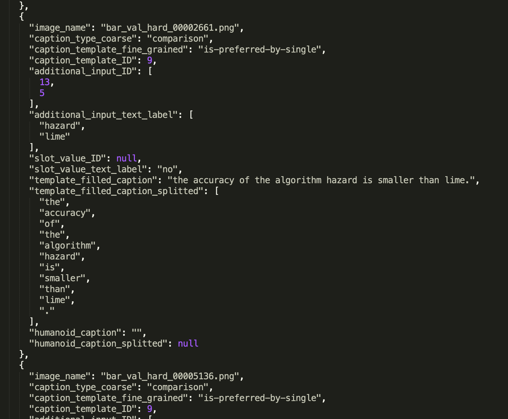
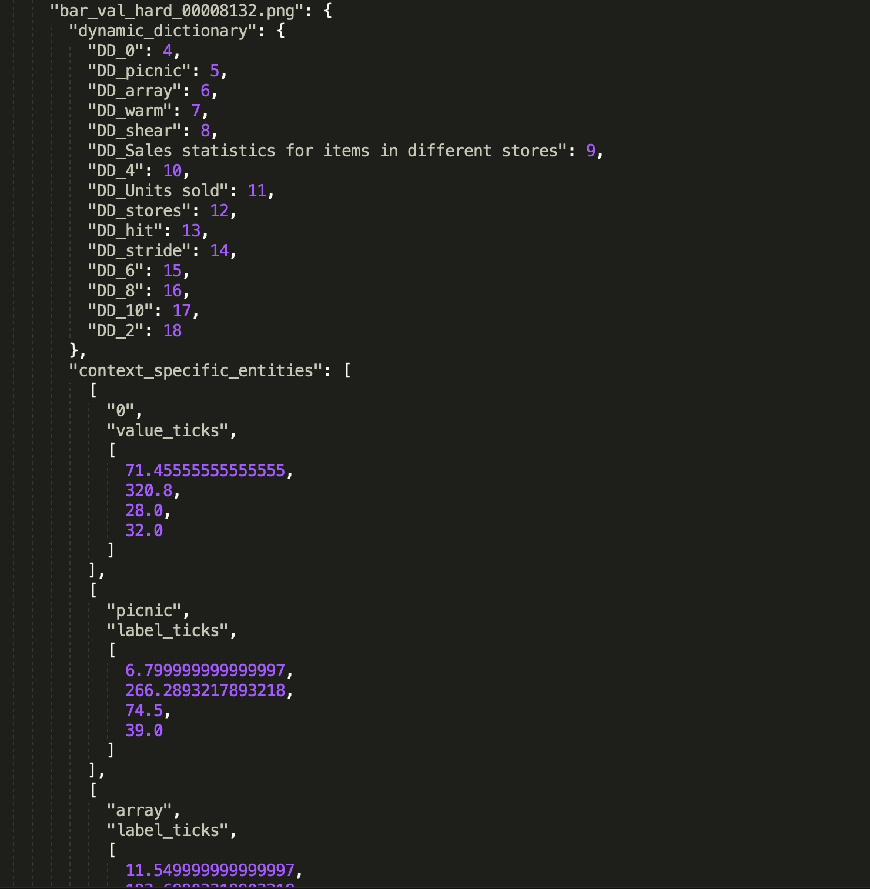

# web2021-figure-captioning

Data and supplementary materials for the paper Generating Accurate Caption Units For Figure Captioning.

### Table of Contents

<!--ts-->
   * [Anonymity Note](#Anonymity-note)
   * [Supplementary Material: Data](#Supplementary-Material-Data)
   * [Supplementary Material: Model Hyperparameters and Other Design Choices](#Supplementary-Material-Model-Hyperparameters-and-Other-Design-Choices)
   * [Supplementary Material: Aggregated Perfect Accuracy](https://github.com/anonymous-web2021-sub/data-release/tree/master/aggregated-perfect-accuracy)
<!--te-->

### Anonymity Note

We are using this dedicated anonymous github account. Instead of solutions such as [anonymous.4open.science](anonymous.4open.science) which cannot handle a few files, e.g. `captions.json` is too big to be anonymized (beyond 1MB, Github limit)

### Supplementary Material: Data

#### Directory Structure

This directory contains three parts of material.

- The `test_hard` split of our dataset: converted groundtruth captions from DVQA and FigureQA datasets, for modeling. Due to size limit, we will release the full split (including `train`, `validation`, and `test_easy`) after review and unanonymously. All splits follow the same schema.
- `quality-validation.xlsx`: a spreadsheet of quality validatio results. Two co-authors did quality validation on a sample of captions from the two `captions.json` files, in two dimensions: accuracy and grammar. The sample covers 20 random captions for each type in each dataset.     
- `user-study-12-figures.html` (along with the directory of `user-study-png-output`): the 12 figures for the Google form user study.
- [`aggregated-perfect-accuracy`](https://github.com/anonymous-web2021-sub/data-release/tree/master/aggregated-perfect-accuracy): Perfect accuracy scores as additional results from Table 3 and 5.

#### `captions.json`

In each `test_hard` split, the file `captions.json` contains groundtruth captions and figure metadata that follow our problem formulation, for modeling.

Figure names are consistent with the original file in the download link of [DVQA](https://github.com/kushalkafle/DVQA_dataset) and [FigureQA](https://github.com/Maluuba/FigureQA) dataset, which we suggest readers to download from ther.

##### An example caption tuple 

##### An example figure metadata tuple

Below code can be used to read JSON objects from `captions.json` files to understand its schema.

    import json

    print("Loading the validation set of converted captions, in JSON, e.g. from DVQA")
    jobject = json.load(open("FigureQA/captions.json", "r"))
    
    print("In this JSON object, the keys are ", jobject.keys())
    print()
    
    print("Total caption count in this validation split", len(jobject['captions']))
    print()
    
    caption_types = set([item['caption_template_fine_grained'] for item in jobject['captions']])
    print("Unique caption types (slight naming difference to Table 1 definition, e.g. horizontal-vertical means figure type)", caption_types)
    print()
    
    print("The metadata for one random figure looks like below (has dynamic dictionary, and bounding box positions)")
    print(jobject['metadata'][list(jobject['metadata'].keys())[0]])
    print()

### Supplementary Material: Model Hyperparameters and Other Design Choices

The `FigJAM` model mainly follows the model configuration and implementation details from [DVQA](https://openaccess.thecvf.com/content_cvpr_2018/papers/Kafle_DVQA_Understanding_Data_CVPR_2018_paper.pdf) (Kafle et al., 2018). 

#### Pre-processing
For data pre-processing before running all models, we resize figure images in all datasets and their corresponding metadata to be 448 × 448.

#### Encoding
To encode figure image, we fine-tune a pre-trained ResNet-50 up to the second last average pooling layer. The pre-trained ResNet-50 comes from [PyTorch and is trained on ImageNet](https://pytorch.org/hub/pytorch_vision_resnet/). As a result, the output image representation has a size of 14 × 14. 

#### Dyanmic Dictionary and Word Embedding
The `FigJAM` model uses the same approach as the `DVQA` baseline to construct the dynamic dictionary. This design greatly reduces the dictionary size.
The dynamic dictionary has XXX slots. It assigns unique IDs to words that appear only in the metadata. 
Other words that appear in the captions but not in the metadata constitute the static dictionary. 
On the `DVQA-cap` dataset, the dynamic and static dictionary of `FigJAM` model have a total size of 93. On the `FigureQA-cap`, the dynamic and static dictionary have a total size of 72.
Dictionary words are represented by 128-dimensional word embedding. An embedding size of 128 is compatible with the reduced dictionary size due to dynamic dictionary. 

#### Model Architecture 
The auxiliary classifier is a 2-layer MLP with an intermediate dimension of 512 and an output dimension that is the same as the dictionary size.
Decoder LSTM has a hidden representation dimension of 256. We use teacher forcing during training and beam search with size 1 during testing.

#### Optimization 
We use the Adam optimizer with a learning rate of 1e-3 and cross-entropy losse. The loss applies to both the auxiliary classifier and the decoder. 
Networks were trained using NVIDIA Titan X graphics card, for 50,000 batches with a batch size of 8.

### Contacts
Thanks for your review attention.

